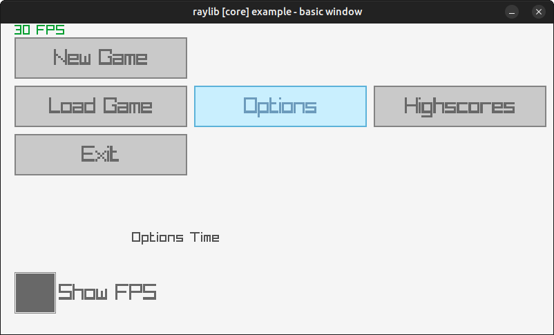

# raygui-container

Adds state to [raygui](https://github.com/raysan5/raygui), allowing for gamepad/keyboard-only support.



## Usage

``` c
#include "raylib.h"

#define RAYGUI_IMPLEMENTATION
#include "raygui.h"

#define RAYGUI_CONTAINER_IMPLEMENTATION
#include "raygui-container.h"

int main(void) {
    InitWindow(800, 450, "raygui-container example");

    // Create the GUI
    GuiContainer gui = InitGuiContainer();
    GuiElement* newGame = AddGuiButton(gui, (Rectangle){ 20, 20, 250, 60 }, "New Game");
    GuiElement* loadGame = AddGuiButton(gui, (Rectangle){ 20, 90, 250, 60 }, "Load Game");

    const char* message = "Use the keyboard to handle input. Arrows/Enter";

    while (!WindowShouldClose()) {
        // Update the GUI state
        UpdateGuiContainer(&gui);

        // Check Button States
        if (IsGuiButtonPressed(newGame)) {
            message = "Pressed the New Game button!";
        }
        if (IsGuiButtonPressed(loadGame)) {
            message = "Now Loading the Game";
        }

        BeginDrawing();
            ClearBackground(RAYWHITE);
            DrawText(message, 190, 300, 20, DARKGRAY);

            // Draw the GUI
            DrawGuiContainer(gui);

        EndDrawing();
    }

    // Unload the GUI
    UnloadGuiContainer(gui);

    CloseWindow();

    return 0;
}
```

## Features

The following controls can be handled through GuiContainers:

- [ ] WindowBox
- [ ] GroupBox
- [ ] Line
- [ ] Panel
- [ ] ScrollPanel
- [ ] Label
- [x] Button
- [ ] LabelButton
- [ ] Toggle
- [ ] ToggleGroup
- [x] CheckBox
- [ ] ComboBox
- [ ] DropdownBox
- [ ] TextBox
- [ ] TextBoxMulti
- [ ] ValueBox
- [ ] Spinner
- [x] Slider
- [ ] SliderBar
- [ ] ProgressBar
- [ ] StatusBar
- [ ] DummyRec
- [ ] Grid
- [ ] ListView
- [ ] ColorPicker
- [ ] MessageBox
- [ ] TextInputBox

## API

``` c
GuiContainer InitGuiContainer();
GuiElement* AddGuiButton(GuiContainer container, Rectangle bounds, const char* text);
GuiElement* AddCheckBox(GuiContainer container, Rectangle bounds, const char* text, bool checked);
void UpdateGuiContainer(GuiContainer* container);
bool IsGuiButtonPressed(GuiElement* element);
bool IsGuiCheckBoxChecked(GuiElement* element);
void UnloadGuiContainer(GuiContainer container);
```

## License

*raygui-container* is licensed under an unmodified zlib/libpng license, which is an OSI-certified, BSD-like license that allows static linking with closed source software. Check [LICENSE](LICENSE) for further details.
